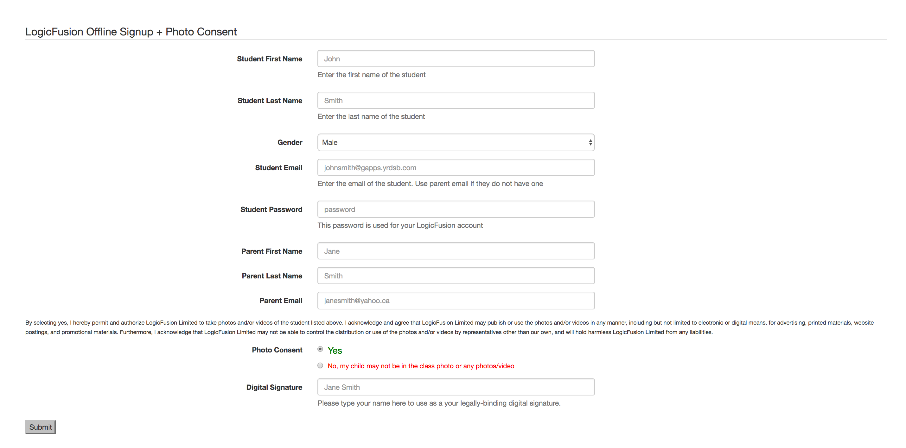
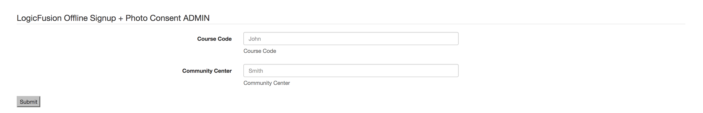

# LogicFusion-Intranet-User-Signup
A web server written in Go that allows parents to connect to intranet and sign up as well as accept photo consent.

## NOTE: This is not meant for rollout to instructors in its current state. This is just for Tim to use. 
###Usage
* Run main.go
* Find the IP in the console and head to localhost:1231/admin.html to set current course that the parents are signing up for

###Screenshots

Main Screen that parents see
 
 
Admin Screen that instructors see
 
